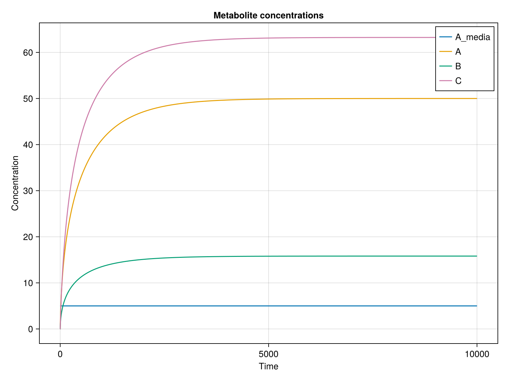

# CellMetabolismBase

[](https://github.com/DenisTitovLab/CellMetabolismBase.jl/actions/workflows/CI.yml?query=branch%3Amain)
[](https://codecov.io/gh/DenisTitovLab/CellMetabolismBase.jl)
[](https://github.com/aviatesk/JET.jl)
[](https://github.com/JuliaTesting/Aqua.jl)

## Overview

CellMetabolismBase.jl is a framework for simulating and analyzing cellular metabolic pathways. The goal of the package is to provide a convenient interface to automatically convert a list of enzymes into a form that can be used by ordinary differential equations (ODE) solvers of [DifferentialEquations.jl](https://docs.sciml.ai/DiffEqDocs/stable/) and [Scientific Machine Learning (SciML)](https://sciml.ai) ecosystems in [Julia Programming Language](https://julialang.org). CellMetabolismBase.jl powers CellMetabolism.jl that enables simulation and analysis of human cell metabolism using a experimentally determined enzyme rate equations.

## Features

- Define `MetabolicPathway` using enzyme rate equations
- Automatically create DifferentialEquations.jl-compatible ODE models from `MetabolicPathway` definitions
- Simulate `MetabolicPathway` activity using DifferentialEquations.jl at a wide range of parameter values and initial conditions
- Estimate model prediction uncertainty for comparison with experimental data
- Automated discovery of parameters that control specific pathway behaviour using Global Sensitivity Analysis (GSA)

## Roadmap

- Add function to validate that `MetabolicPathway` is defined correctly, such as testing enzyme rate equations, determining conserved moieties, and ensuring conservation of atoms
- Add support for Global Sensitivity Analysis (GSA) to identify parameters that control specific pathway behaviour
- Add ability to simulate isotope tracing equations for a given `MetabolicPathway` definition
- Add support for units of parameters and initial conditions to ensure that the models are dimensionally consistent

## Installation

```julia
using Pkg
Pkg.add("CellMetabolismBase")
```

## Basic Example

```julia
using CellMetabolismBase, OrdinaryDiffEq, LabelledArrays, CairoMakie, Distributions


# We'll investigate a simple metabolic pathway with three enzymes:
# Enz1: A_media → A
# Enz2: A → 2B
# Enz3: B → C

# Define a simple enzyme-catalyzed pathway consisting of three enzymes:
# First argument is a tuple of constant metabolites (if any)
# Second argument is a tuple of enzyme definitions
# Each enzyme is defined as (enzyme_name, (substrates...), (products...))
pathway = MetabolicPathway(
    (:A_media,),
    ((:Enz1, (:A_media,), (:A,)), (:Enz2, (:A,), (:B, :B)), (:Enz3, (:B,), (:C,))),
)

# Define enzyme rate laws
function CellMetabolismBase.enzyme_rate(::Enzyme{:Enz1,(:A_media,),(:A,)}, metabs, params)
    rate =
        params.Enz1_Vmax * (metabs.A_media - metabs.A / params.Enz1_Keq) /
        (1 + metabs.A_media / params.Enz1_K_A_media + metabs.A / params.Enz1_K_A)
    return rate
end
function CellMetabolismBase.enzyme_rate(::Enzyme{:Enz2,(:A,),(:B, :B)}, metabs, params)
    rate =
        params.Enz2_Vmax * (metabs.A - metabs.B^2 / params.Enz2_Keq) /
        (1 + metabs.A / params.Enz2_K_A + (metabs.B / params.Enz2_K_B)^2)
    return rate
end
function CellMetabolismBase.enzyme_rate(::Enzyme{:Enz3,(:B,),(:C,)}, metabs, params)
    rate =
        params.Enz3_Vmax * (metabs.B - metabs.C / params.Enz3_Keq) /
        (1 + metabs.B / params.Enz3_K_B + metabs.C / params.Enz3_Keq)
    return rate
end

# Set initial conditions
init_cond = LVector(A_media = 5.0, A = 0.0, B = 0.0, C = 0.0)

# Set parameters
params = LVector(
    Enz1_Vmax = 1.0,
    Enz1_Keq = 10.0,
    Enz1_K_A_media = 1.0,
    Enz1_K_A = 1.0,
    Enz2_Vmax = 1.5,
    Enz2_Keq = 5.0,
    Enz2_K_A = 0.5,
    Enz2_K_B = 0.5,
    Enz3_Vmax = 2.0,
    Enz3_Keq = 4.0,
    Enz3_K_B = 0.3,
)

# Create and solve ODE problem
tspan = (0.0, 10000.0)
prob = make_ODEProblem(pathway, init_cond, tspan, params)
sol = solve(prob, Rodas5P(), abstol = 1e-15, reltol = 1e-8)

# Plot results
fig = Figure()
ax = Axis(fig[1, 1], xlabel = "Time", ylabel = "Concentration")
for metabolite in propertynames(init_cond)
    lines!(ax, sol.t, [u[metabolite] for u in sol.u], label = string(metabolite))
end
axislegend(ax)
fig
```



## Ensemble Simulations

Ensemble simulations allow you to explore parameter or initial condition variations:

```julia
# We'll use the pathway defined in the Basic Example with the same packages

# Create a range of A_media values to explore
A_media_values = range(1.0, 10.0, 50)

# Use the same parameters for all simulations
params = LVector(
    Enz1_Vmax = 1.0, Enz1_Keq = 10.0, Enz1_K_A_media = 1.0, Enz1_K_A = 1.0,
    Enz2_Vmax = 1.5, Enz2_Keq = 5.0, Enz2_K_A = 0.5, Enz2_K_B = 0.5,
    Enz3_Vmax = 2.0, Enz3_Keq = 4.0, Enz3_K_B = 0.3,
)

# Generate different initial conditions for each A_media value
init_conditions = [LVector(A_media = a_media, A = 0.0, B = 0.0, C = 0.0) for a_media in A_media_values]

# Run to steady state
tspan = (0.0, 1e8) # Long enough to reach steady state
ensemble_prob = make_EnsembleProblem(pathway, init_conditions, params; tspan = tspan)
ensemble_sol = solve(ensemble_prob, Rodas5P(), trajectories=length(A_media_values))

# Plot steady state values vs A_media
fig = Figure(size=(800, 600))
ax = Axis(fig[1, 1],
          xlabel = "A_media concentration",
          ylabel = "Steady-state concentration",
          title = "Effect of A_media on steady-state metabolite levels")
# Plot each metabolite with different colors - processing data directly in the loop
colors = Makie.wong_colors()
for (i, metab) in enumerate(propertynames(init_conditions[1]))
    metab == :A_media && continue  # Skip plotting A_media against itself
    # Extract this metabolite's steady state values directly here
    metab_values = [sol[end][metab] for sol in ensemble_sol]
    lines!(ax, A_media_values, metab_values,
           label=string(metab), color=colors[mod1(i, length(colors))], linewidth=2)
end
axislegend(ax)
fig
```


## Uncertainty quantification using Distributions of parameter values

Easily explore parameter space by sampling from statistical distributions:

```julia
# We'll use the pathway defined in the Basic Example with the same packages

# Define initial conditions
init_cond = LVector(A_media = 5.0, A = 0.0, B = 0.0, C = 0.0)

# Define parameter distributions
params_dist = LVector(
    Enz1_Vmax = Uniform(0.8, 1.2),
    Enz1_Keq = Normal(10.0, 1.0),
    Enz1_K_A_media = Uniform(0.8, 1.2),
    Enz1_K_A = Uniform(0.8, 1.2),
    Enz2_Vmax = LogNormal(0.0, 0.2),
    Enz2_Keq = Normal(5.0, 0.5),
    Enz2_K_A = Uniform(0.3, 0.7),
    Enz2_K_B = Uniform(0.3, 0.7),
    Enz3_Vmax = Uniform(1.8, 2.2),
    Enz3_Keq = Normal(4.0, 0.4),
    Enz3_K_B = Uniform(0.2, 0.4),
)

# Create ensemble problem with parameter sampling
tspan = (0.0, 10000.0)
ensemble_prob = make_EnsembleProblem(pathway, init_cond, params_dist; n_bootstraps = 100)
ensemble_sol = solve(ensemble_prob, Rodas5P(), trajectories = 100)

# Plot each metabolite with uncertainty bands
fig = Figure(size = (800, 600))
ax = Axis(
    fig[1, 1],
    xlabel = "Time",
    ylabel = "Concentration",
    title = "Metabolite concentrations with uncertainty",
)
times = range(0, 10000, 100)
colors = Makie.wong_colors()
for (i, metab) in enumerate(propertynames(init_cond))
    # Get all values across ensemble at each time point in a single comprehension
    metab_data = [[sol(t)[metab] for sol in ensemble_sol] for t in times]
    # Calculate statistics in one line each
    means = [mean(vals) for vals in metab_data]
    stds = [std(vals) for vals in metab_data]
    # Plot with a specific color
    color = colors[mod1(i, length(colors))]
    lines!(ax, times, means, label = string(metab), color = color)
    band!(ax, times, means .- stds, means .+ stds, color = (color, 0.3))
end
axislegend(ax)
fig
```

